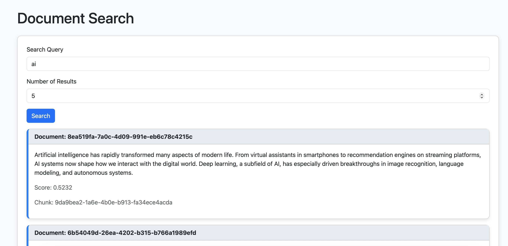

# DocEmbed

DocEmbed is a scalable document embedding system designed to process, store, and query document embeddings using Qdrant as a vector database. It leverages Kubernetes (EKS) for deployment, RabbitMQ for task queuing, and Celery for distributed task processing. The system includes a UI, a query service, and workers to handle PDF processing and embedding generation.

The web UI is available at [this link](http://acc92feef718c478e8e67a3daa5083f8-729555859.us-east-2.elb.amazonaws.com).


# Design Overview

The system starts with file ingestion via the s3_ingestor, which uploads incoming files to an Amazon S3 bucket. A scalable Kubernetes (K8s) cluster, deployed on EKS and backed by EC2 instances, provides both horizontal and vertical scaling capabilities to support dynamic workloads.

#### File Processing Pipeline:
Scheduled Celery workers continuously poll the S3 bucket for new files.
Upon detection, each file is broken down into paragraph-level chunks.
Each chunk is assigned a unique identifier and then published to a persistent RabbitMQ message broker for downstream processing.

#### Embedding and Storage:
Celery consumers subscribe to RabbitMQ, retrieving the chunks.
Each chunk is passed through a language embedding model to generate a high-dimensional vector representation.
The resulting embedding, along with metadata (file ID, chunk ID, and raw text), is stored in a scalable vector database (Qdrant), which is backed by persistent storage.

#### Query Processing:
When a user query is received through the Application Load Balancer (ALB), a worker:
Converts the query into an embedding using the same language model.
Performs a cosine similarity search against the vector database.
Returns the most relevant chunks as results.

#### Scalability & Cost Efficiency:
All core components—including Celery workers, RabbitMQ, and Qdrant—are containerized and scale independently to handle varying loads efficiently.
The architecture is highly cost-efficient, leveraging a cloud-agnostic stack that minimizes vendor lock-in and optimizes resource usage. This flexibility is a major advantage for both portability and long-term cost control.

#### TODO
 - Refactor and clean the codebase; eliminate all hardcoded configuration values.
 - Integrate system monitoring using Prometheus and Grafana for better observability and operational insight.
 - Add Tests and setup CI/CD pipelines.

## Table of Contents

- Prerequisites
- Architecture Overview
- Setup and Deployment
  - Create EKS Cluster
  - Deploy Qdrant with Persistent Storage
  - Test Persistent Storage
  - Deploy RabbitMQ
  - Deploy Celery Workers
  - Deploy Query Service
  - Deploy UI Service
  - Run Scheduler
- Building and Pushing Docker Images
  - Qdrant Client
  - Celery PDF Worker
  - Celery Embed Worker
  - Query Service
  - UI Service
- Debugging Commands
- Usage
- License

## Prerequisites

- AWS CLI configured with appropriate credentials
- `eksctl` for managing EKS clusters
- `kubectl` for interacting with Kubernetes
- `helm` for deploying RabbitMQ and Qdrant
- Docker installed for building and pushing images
- AWS ECR access for container registry

## Architecture Overview

- **Qdrant**: Vector database for storing and querying document embeddings.
- **RabbitMQ**: Message broker for task queuing.
- **Celery Workers**: Handle PDF processing and embedding generation.
- **Query Service**: API for querying embeddings.
- **UI Service**: Web interface for interacting with the system.
- **EKS**: Kubernetes cluster for orchestration.
- **EBS**: Persistent storage for Qdrant and RabbitMQ.

## Setup and Deployment

### Create EKS Cluster

Create an EKS cluster using the provided configuration file:

```bash
eksctl create cluster -f eks-cluster.yaml
```

Verify the cluster:

```bash
eksctl get cluster --region us-east-2
kubectl get nodes
```

### Deploy Qdrant with Persistent Storage

Add the Qdrant Helm repository and deploy Qdrant with persistent storage:

```bash
helm repo add qdrant https://qdrant.github.io/qdrant-helm
helm repo update
kubectl apply -f ebs-storageclass.yaml
helm install qdrant qdrant/qdrant -f qdrant-values.yaml --namespace qdrant --create-namespace
```

Test Qdrant connectivity:

```bash
kubectl port-forward svc/qdrant -n qdrant 6333:6333
curl http://localhost:6333/collections
```

### Test Persistent Storage

Verify that data persists across pod restarts:

1. Restart the Qdrant pod:

   ```bash
   kubectl delete pod -n qdrant -l app.kubernetes.io/name=qdrant
   ```

2. Wait for the pod to restart:

   ```bash
   kubectl get pods -n qdrant
   ```

3. Verify data persistence:

   ```bash
   curl http://localhost:6333/collections/test_collection
   ```

   The collection and its points (e.g., ID 1 with payload `{"color": "red"}`) should still exist.

### Deploy RabbitMQ

Deploy RabbitMQ with persistent storage:

```bash
helm repo add bitnami https://charts.bitnami.com/bitnami
helm repo update
helm install rabbitmq bitnami/rabbitmq -f rabbitmq-values.yaml --namespace qdrant
```

Access RabbitMQ management UI:

```bash
kubectl port-forward svc/rabbitmq -n qdrant 15672:15672
```

RabbitMQ is accessible at `rabbitmq.qdrant.svc.cluster.local:5672`.

### Deploy Celery Workers

1. **Create IAM Service Account** for Celery PDF worker:

   ```bash
   eksctl create iamserviceaccount \
     --cluster doc-embed \
     --namespace qdrant \
     --name celery-pdf-worker \
     --attach-policy-arn arn:aws:iam::aws:policy/AmazonEC2ContainerRegistryReadOnly \
     --attach-policy-arn arn:aws:iam::aws:policy/AmazonS3ReadOnlyAccess \
     --approve \
     --region us-east-2
   ```

2. **Deploy Celery PDF Worker**:

   ```bash
   kubectl apply -f celery-pdf-worker-deployment.yaml
   ```

3. **Deploy Celery Embed Worker**:

   ```bash
   kubectl apply -f celery-embed-worker-deployment.yaml
   ```

### Deploy Query Service

Deploy the query service and its associated Kubernetes service:

```bash
kubectl apply -f query-service-deployment.yaml
kubectl apply -f query-service-service.yaml
```

### Deploy UI Service

Deploy the UI service and its associated Kubernetes service:

```bash
kubectl apply -f ui-service-deployment.yaml
kubectl apply -f ui-service-service.yaml
```

### Run Scheduler

Deploy a CronJob to trigger periodic tasks:

```bash
kubectl apply -f celery-pdf-trigger-cronjob.yaml
```


## Building and Pushing Docker Images

### Qdrant Client

```bash
docker build --no-cache -t qdrant-client:latest .
aws ecr create-repository --repository-name qdrant-client --region us-east-2
aws ecr get-login-password --region us-east-2 | docker login --username AWS --password-stdin 705926388196.dkr.ecr.us-east-2.amazonaws.com
docker tag qdrant-client:latest 705926388196.dkr.ecr.us-east-2.amazonaws.com/qdrant-client:latest
docker push 705926388196.dkr.ecr.us-east-2.amazonaws.com/qdrant-client:latest
kubectl apply -f qdrant-client-deployment.yaml
```

### Check status:

```bash
kubectl get deployments -n qdrant
kubectl get pods -n qdrant
kubectl logs -n qdrant -l app=qdrant-test-app
kubectl get pods -n qdrant -l app=qdrant-test-app --field-selector=status.phase!=Running
```

### Celery PDF Worker

```bash
cd publisher
aws ecr create-repository --repository-name celery-pdf-worker --region us-east-2
docker build -t celery-pdf-worker .
aws ecr get-login-password --region us-east-2 | docker login --username AWS --password-stdin 705926388196.dkr.ecr.us-east-2.amazonaws.com
docker tag celery-pdf-worker:latest 705926388196.dkr.ecr.us-east-2.amazonaws.com/celery-pdf-worker:latest
docker push 705926388196.dkr.ecr.us-east-2.amazonaws.com/celery-pdf-worker:latest
```

### Celery Embed Worker

```bash
cd consumer
aws ecr create-repository --repository-name celery-embed-worker --region us-east-2
docker build --no-cache -t celery-embed-worker -f Dockerfile .
aws ecr get-login-password --region us-east-2 | docker login --username AWS --password-stdin 705926388196.dkr.ecr.us-east-2.amazonaws.com
docker tag celery-embed-worker:latest 705926388196.dkr.ecr.us-east-2.amazonaws.com/celery-embed-worker:latest
docker push 705926388196.dkr.ecr.us-east-2.amazonaws.com/celery-embed-worker:latest
```

### Query Service

```bash
cd query-engine
docker build --no-cache -t query-service -f Dockerfile .
aws ecr create-repository --repository-name query-service --region us-east-2
aws ecr get-login-password --region us-east-2 | docker login --username AWS --password-stdin 705926388196.dkr.ecr.us-east-2.amazonaws.com
docker tag query-service:latest 705926388196.dkr.ecr.us-east-2.amazonaws.com/query-service:latest
docker push 705926388196.dkr.ecr.us-east-2.amazonaws.com/query-service:latest
```

### UI Service

```bash
cd ui
docker build --no-cache -t ui-service -f Dockerfile .
aws ecr create-repository --repository-name ui-service --region us-east-2
aws ecr get-login-password --region us-east-2 | docker login --username AWS --password-stdin 705926388196.dkr.ecr.us-east-2.amazonaws.com
docker tag ui-service:latest 705926388196.dkr.ecr.us-east-2.amazonaws.com/ui-service:latest
docker push 705926388196.dkr.ecr.us-east-2.amazonaws.com/ui-service:latest
```
